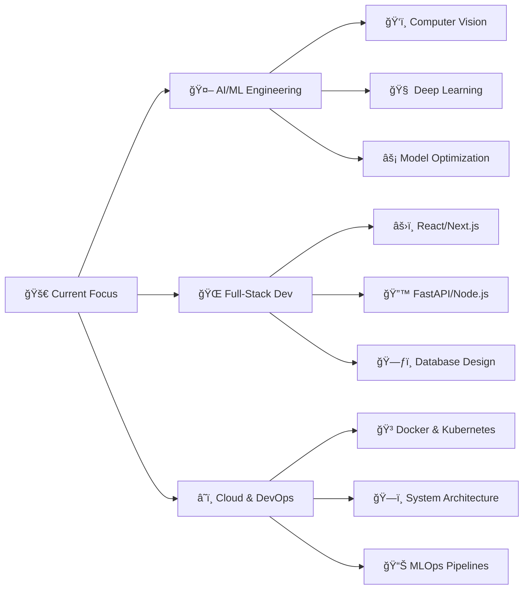

<div align="center">

  <!-- 1. The Visual Header -->
 

  <!-- 2. The Dynamic Intro -->


  <br>

  <!-- 3. The Stats Badges -->
<p align="center">
    
    &nbsp;&nbsp;&nbsp;&nbsp;
    
    &nbsp;&nbsp;&nbsp;&nbsp;
    
    &nbsp;&nbsp;&nbsp;&nbsp;
    
  </p>

</div>

<br>

## 🎯 What I Do

```python
class AIDeveloper:
    def __init__(self):
        self.name = "Jayadeep Pendela"
        self.title = "AI/ML Engineer & Full-Stack Developer"
        self.specialties = {
            "ai_ml": ["Computer Vision", "Deep Learning", "Model Deployment"],
            "web_dev": ["React", "Next.js", "FastAPI", "Node.js"],
            "tools": ["PyTorch", "TensorFlow", "OpenCV", "Docker"]
        }
        self.philosophy = "Build → Learn → Iterate → Scale"
    
    def current_focus(self):
        return {
            "research": "Advanced Computer Vision Models",
            "development": "Scalable ML Pipelines",
            "learning": "System Design & Architecture"
        }
    
    def get_quote(self):
        return "I don't just write code; I engineer intelligence ✨"

dev = AIDeveloper()
print(dev.get_quote())
```

<br>

## 🛠️ **Technical Arsenal**

###  Languages & Core Technologies

<table align="center">
<tr>
<td align="center" width="96">

<br>Python
</td>
<td align="center" width="96">

<br>Java
<td align="center" width="96">

<br>C++
</td>
<td align="center" width="96">

<br>C
</td>
</td>
</td>
<td align="center" width="96">

<br>C#
</td>
<td align="center" width="96">

<br>JavaScript
</td>
<td align="center" width="96">

<br>HTML5
</td>
</td>
<td align="center" width="96">

<br>CSS3
</td>
</tr>
</table>

### 🤖 AI & Machine Learning

<table align="center">
<tr>
<td align="center" width="96">

<br>TensorFlow
</td>
<td align="center" width="96">

<br>PyTorch
</td>
<td align="center" width="96">

<br>OpenCV
</td>
<td align="center" width="96">

<br>Scikit-learn
</td>
<td align="center" width="96">

<br>Keras
</td>
<td align="center" width="96">

<br>NumPy
</td>
<td align="center" width="96">

<br>Pandas
</td>
<td align="center" width="96">

<br>Matplotlib
</tr>
</table>

### 🌐 Web Development

<table align="center">
<tr>
<td align="center" width="96">

<br>React
</td>
<td align="center" width="96">

<br>Next.js
</td>
<td align="center" width="96">

<br>Tailwind
</td>
<td align="center" width="96">

<br>Vite
</td>
<td align="center" width="96">

<br>Node.js
</td>
<td align="center" width="96">

<br>Express.js
</td>
<td align="center" width="96">

<br>Django
</td>
<td align="center" width="96">

<br>Flask
</td>
</tr>
<tr>
<td align="center" width="96">

<br>FastAPI
</td>
<td align="center" width="96">

<br>Vercel
</td>
<td align="center" width="96">

<br>Firebase
</td>
<td align="center" width="96">

<br>Supabase
</td>
<td align="center" width="96">

<br>Postman
</td>
<td align="center" width="96">

<br>Swagger
</td>
<td align="center" width="96">
 
<br>Figma
</td>


</tr>
</table>

### 🗄️ Databases & Cloud

<table align="center">
<tr>
<td align="center" width="96">

<br>MongoDB
</td>
<td align="center" width="96">

<br>MySQL
</td>
<td align="center" width="96">

<br>PostgreSQL
</td>
<td align="center" width="96">

<br>Firebase
</td>
<td align="center" width="96">

<br>Supabase
</td>
<td align="center" width="96">

<br>Vercel
</td>
<td align="center" width="96">

<br>Render
</td>
</tr>
</table>

### ⚙️ Tools & Utilities

<table align="center">
<tr>

<td align="center" width="96">

<br>Git
</td>
<td align="center" width="96">

<br>Bash
</td>
<td align="center" width="96">

<br>GitHub
</td>
<td align="center" width="96">

<br>Docker
</td>
<td align="center" width="96">

<br>Selenium
</td>
<td align="center" width="96">

<br>Twilio
</td>
<td align="center" width="96">

<br>Canva
</td>
<td align="center" width="96">

<br>Markdown
</td>
<td align="center" width="96">

<br>Vs code
</td>
</tr>
</table>

<br>

## 📊 GitHub Analytics

<div align="center">

<!-- GitHub Stats -->
<a href="https://github.com/Jayadeep8712">
  
  
</a>

</div>

<div align="center">

<!-- Streak Stats -->
<a href="https://github.com/Jayadeep8712">
  
</a>

</div>

<br>

## 📈 Activity Graph

<div align="center">

[](https://github.com/ashutosh00710/github-readme-activity-graph)

</div>

<br>

## 🏆 GitHub Trophies

<div align="center">

[](https://github.com/ryo-ma/github-profile-trophy)

</div>

<br>

## 🎯 Current Focus & Roadmap


<br>

## 📊 Detailed Stats

<div align="center">


</div>

<br>

## 🎵 Coding Vibes

<div align="center">


</div>

<br>

## 🎨 Projects Showcase

<div align="center">

| 🤖 AI/ML Projects | 🌐 Full-Stack Apps | 🔬 Computer Vision |
|:---:|:---:|:---:|
| 🚀 Smart Automation | 📚 Digital Libraries | 👁️ Real-time Analysis |
| 🔧 ML Pipelines | ⚛️ React Applications | 🎯 Object Detection |
| ☁️ Model Deployment | 🔌 API Development | 🖼️ Image Processing |

</div>

<br>

## 💡 Developer Quotes

<div align="center">


</div>


## 📫 Let's Connect & Collaborate

<div align="center">

[](https://www.linkedin.com/in/jayadeep-pendela-100278225/)
[](mailto:pendelajayadeep@gmail.com)
[](https://github.com/Jayadeep8712)
[](https://github.com/Jayadeep8712)
[](https://Instagram.com)
</div>

<br>

## 🌟 Support & Recognition

<div align="center">

If you like what I do, maybe consider buying me a coffee/tea 🥺👉👈

<a href="https://www.buymeacoffee.com/jayadeep" target="_blank"></a>

</div>


## 🎮 Fun Section

<div align="center">


</div>

<div align="center">

<br>

### ⚡ **Did You Know?**
*I once trained a model that could differentiate between 50+ coffee bean varieties with 95% accuracy! ☕🤖*

**"Code is like humor. When you have to explain it, it's bad." - Cory House**


**Thanks for stopping by! Let's build something amazing together!** 🚀

  

</div>

---

<div align="center">

*"The best way to predict the future is to invent it." - Alan Kay*

</div>
