# 💫 About Me
<div align="center">

  <!-- 1. The Visual Header -->
  

  <!-- 2. The Dynamic Intro (I chose the Fira Code version, it looks more 'coder' like) -->
  

  <br>

  <!-- 3. The Stats Badges (Side by Side with gaps) -->
  <p align="center">
    
    &nbsp;&nbsp;&nbsp;&nbsp;
    
    &nbsp;&nbsp;&nbsp;&nbsp;
    
    &nbsp;&nbsp;&nbsp;&nbsp;
    
  </p>

</div>

## 🎯 What I Do

```
class AIDeveloper:
    def __init__(self):
        self.name = "Jayadeep Pendela"
        self.title = "AI/ML Engineer & Full-Stack Developer"
        self.specialties = {
            "ai_ml": ["Computer Vision", "Deep Learning", "Model Deployment"],
            "web_dev": ["React", "Next.js", "FastAPI", "Node.js"],
            "tools": ["PyTorch", "TensorFlow", "OpenCV", "Docker"]
        }
        self.philosophy = "Build → Learn → Iterate → Scale"
    
    def current_focus(self):
        return {
            "research": "Advanced Computer Vision Models",
            "development": "Scalable ML Pipelines",
            "learning": "System Design & Architecture"
        }
    
    def get_quote(self):
        return "I don't just write code; I engineer intelligence ✨"

dev = AIDeveloper()
print(dev.get_quote())
```

## 🛠️ **Technical Arsenal**

### 💻 **Languages**
<div align="center">
    


</div>

### 🤖 **AI, Data Science & Machine Learning**
<div align="center">
    


</div>

### 🌐 **Web Development (Frontend & Backend)**
<div align="center">
    


</div>

### 🗄️ **Databases & Cloud**
<div align="center">
    


</div>

### ⚙️ **Tools, DevOps & Utilities**
<div align="center">
    


</div>


## 📊 GitHub Analytics

<div align="center">
<!-- GitHub Stats with Custom Theme -->
<a href="https://github.com/Jayadeep8712">
  
  
</a>
</div>

<div align="center">
<!-- Streak Stats -->
<a href="https://github.com/Jayadeep8712">
  
</a>

</div>


## 📈 Activity Graph

<div align="center">

[](https://github.com/ashutosh00710/github-readme-activity-graph)

</div>

## 🏆 GitHub Trophies

<div align="center">

[](https://github.com/Jayadeep8712)

</div>

## 🎯 Current Focus & Roadmap

```mermaid
graph LR
    A[🚀 Current Focus] --> B[🤖 AI/ML Engineering];
    A --> C[🌐 Full-Stack Dev];
    A --> D[☁️ Cloud & DevOps];
    
    B --> B1[👁️ Computer Vision];
    B --> B2[🧠 Deep Learning];
    B --> B3[⚡ Model Optimization];
    
    C --> C1[⚛️ React/Next.js];
    C --> C2[🔙 FastAPI/Node.js];
    C --> C3[🗃️ Database Design];
    
    D --> D1[🐳 Docker & Kubernetes];
    D --> D2[🏗️ System Architecture];
    D --> D3[📊 MLOps Pipelines];
```



## 📊 Detailed Stats

<div align="center">


</div>

## 🎵 Coding Vibes

<div align="center">


</div>

## 🎨 Projects Showcase

<div align="center">

| 🤖 AI/ML Projects | 🌐 Full-Stack Apps | 🔬 Computer Vision |
|:---:|:---:|:---:|
| 🚀 Smart Automation | 📚 Digital Libraries | 👁️ Real-time Analysis |
| 🔧 ML Pipelines | ⚛️ React Applications | 🎯 Object Detection |
| ☁️ Model Deployment | 🔌 API Development | 🖼️ Image Processing |

</div>

## 💡 Developer Quotes

<div align="center">


</div>

## 📫 Let's Connect & Collaborate

<div align="center">

[](https://www.linkedin.com/in/jayadeep-pendela-100278225/)
[](mailto:pendelajayadeep@gmail.com)
[](#)
[](https://github.com/Jayadeep8712)

</div>

## 🌟 Support & Recognition

<div align="center">

If you like what I do, maybe consider buying me a coffee/tea 🥺👉👈

<a href="https://www.buymeacoffee.com/" target="_blank"></a>

</div>

## 🎮 Fun Section

<div align="center">


</div>

---

<div align="center">

### ⚡ **Did You Know?**
*I once trained a model that could differentiate between 50+ coffee bean varieties with 95% accuracy! ☕🤖*

**"Code is like humor. When you have to explain it, it's bad." - Cory House**


**Thanks for stopping by! Let's build something amazing together!** 🚀


</div>

---

<div align="center">

*"The best way to predict the future is to invent it." - Alan Kay*

</div>

<!--
**Jayadeep8712/Jayadeep8712** is a ✨ _special_ ✨ repository because its `README.md` (this file) appears on your GitHub profile.
-->
