# 💫 About Me

<div align="center">


</div>

<div align="center">


</div>

## 🚀 About Me

```python
class Developer:
    def __init__(self):
        self.name = "Jayadeep Pendela"
        self.role = "AI/ML & Full-Stack Developer"
        self.passion = "Building practical AI solutions"
        self.focus = ["Computer Vision", "ML Pipelines", "Full-Stack Architecture"]
    
    def current_work(self):
        return "Enhancing computer vision projects and deployment efficiency"
    
    def learning(self):
        return ["System Design", "Scalable Architecture", "Advanced ML Techniques"]
    
    def philosophy(self):
        return "I learn faster by building than by reading"

me = Developer()
```

## 🛠️ Tech Stack

### 🤖 **AI & Machine Learning**
<div align="center">


</div>

### 🌐 **Full-Stack Development**
<div align="center">


</div>

### 🗄️ **Databases & Cloud**
<div align="center">


</div>

## 📊 GitHub Analytics

<div align="center">

<!-- GitHub Stats Cards -->
<a href="https://github.com/Jayadeep8712">
  
  
</a>

<!-- Streak Stats -->
<a href="https://github.com/Jayadeep8712">
  
</a>

</div>

## 📈 Activity Graph

<div align="center">

[](https://github.com/Jayadeep8712)

</div>

## 🏆 GitHub Trophies

<div align="center">

[](https://github.com/Jayadeep8712)

</div>

## 🎯 Current Focus

```mermaid
graph TD
    A[🚀 Current Focus] --> B[🤖 Computer Vision];
    A --> C[⚡ AI Model Deployment];
    A --> D[🏗️ System Architecture];
    
    B --> B1[👁️ Object Detection];
    B --> B2[🖼️ Image Processing];
    B --> B3[⏱️ Real-time Analysis];
    
    C --> C1[⚙️ Optimization];
    C --> C2[📈 Scalability];
    C --> C3[🔧 ML Pipelines];
    
    D --> D1[🔙 Backend Design];
    D --> D2[🗃️ Database Architecture];
    D --> D3[☁️ Cloud Integration];
```



## 📊 GitHub Profile Summary Cards

<div align="center">


</div>

## 🎵 Coding Vibes

<div align="center">


</div>

## 📝 Latest Blog Posts
<!-- BLOG-POST-LIST:START -->
- *Coming Soon...*
<!-- BLOG-POST-LIST:END -->

## 🎨 Projects Showcase

<div align="center">

| 🤖 AI/ML Projects | 🌐 Full-Stack Apps | 🔬 Computer Vision |
|:---:|:---:|:---:|
| 🚀 Smart Automation | 📚 Digital Libraries | 👁️ Real-time Analysis |
| 🔧 ML Pipelines | ⚛️ React Applications | 🎯 Object Detection |
| ☁️ Model Deployment | 🔌 API Development | 🖼️ Image Processing |

</div>

## 💡 Developer Quotes

<div align="center">


</div>

## 📫 Connect With Me

<div align="center">

[](https://www.linkedin.com/in/jayadeep-pendela-100278225/)
[](mailto:pendelajayadeep@gmail.com)
[](#)
[](https://github.com/Jayadeep8712)
[](https://twitter.com/)

</div>

## 🎮 Fun Section

<div align="center">


</div>

## 💡 Developer Philosophy

<div align="center">

> **"I don't just write code; I build solutions that learn, adapt, and make an impact."**

</div>

---

<div align="center">

### ⚡ **Fun Fact**
*I once trained a model that could identify coffee types just by looking at the beans! ☕*


**Thanks for visiting!** ✨


</div>

<!--
**Jayadeep8712/Jayadeep8712** is a ✨ _special_ ✨ repository because its `README.md` (this file) appears on your GitHub profile.
-->

<style>
  .capsule-render {
    border-radius: 20px;
  }
  
  .stats-card {
    border-radius: 15px;
    padding: 10px;
    margin: 5px;
  }
</style>
